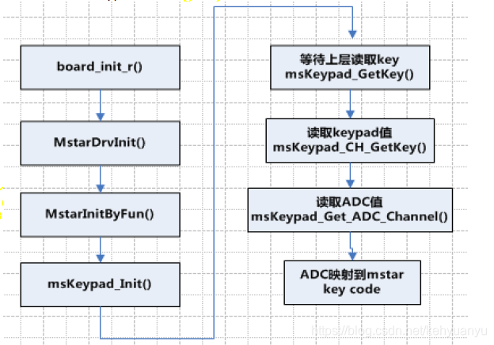

# M平台按键强制升级流程分析

文件主要来源：[https://blog.csdn.net/kehyuanyu/article/details/102756245]

**摘要**：本文详细解析了MStar平台的升级流程，包括mboot开机过程中的升级触发条件，以及按键检测流程。介绍了如何通过按键板上的特定按键进入不同的升级模式，如USB升级和OTA升级。

MStar平台的升级流程主要在mboot启动过程中进行，通过检测不同的触发条件从而进入升级流程。首先，我们了解一下mboot的启动流程。

## 启动流程

汇编部分不同方案大致相同，我们主要以C部分启动流程为主，分析升级流程：

* `start.S` 跳转执行 `board_init_f`
* 板级初始化 `board_init_r` (@\MBoot\u-boot-2011.06\arch\arm\lib\board.c)
* MStar系统初始化 `MstarSysInit`
* 板初始化 `board_init`
* NAND, 串口(serial), 以太网(eth), 中断初始化
* MStar驱动初始化 `MstarDrvInit`
* `main_loop` (`MstarProcess`, `MstarToKernel`) 初始化
* `MstarProcess`, `MstarToKernel` 注册mboot常用的功能（命令行指令）

上面只是一个大致的框架，抽取该平台特殊的部分，主要在 `vendor\mstar\mboot\MBoot\MstarApp\src\MsStart.c` 中：

```c
BOOLEAN MstarProcess(void)
{

# if CONFIG_MINIUBOOT

    run_command("updatemiureg", 0);
    run_command("bootargs_set", 0);

# else

    ......
    Customer_Register_Process();  // MsCustomerRegister.c 中完成具体注册
    Customer_Register_ToKernel(); //  MsCustomerRegister.c 中完成具体注册
    pCmd=getFirstCmd();
    if(pCmd==NULL)
    {
        UBOOT_DEBUG("There are no any cmds in table\n");
        return TRUE;
    }
   // 从command 中循环获取指令执行
    while(1)
    {
        if(pCmd->stage == STAGE_PROCESS)
        {
            UBOOT_BOOTTIME("[AT][MB][%s][%lu]_start\n",pCmd->cmd, MsSystemGetBootTime());
            run_command(pCmd->cmd,  pCmd->flag);
            UBOOT_BOOTTIME("[AT][MB][%s][%lu]_end\n",pCmd->cmd, MsSystemGetBootTime());
        }
        pCmd=getNextCmd(pCmd);
        if(pCmd==NULL)
        {
            UBOOT_DEBUG("It's the last cmd\n");
            break;
        }
    }
    UBOOT_TRACE("OK\n");
 #endif
    return TRUE;
}
```

`MstarToKernel` 在 `MstarProcess` 注册的基础上，执行命令完成对应功能：

```c
BOOLEAN MstarToKernel(void)
{

# if CONFIG_MINIUBOOT

    run_command("bootcheck", 0);    //  启动检测
    #if (CONFIG_PANEL_INIT)
    run_command("panel_pre_init", 0);   //  屏的预初始化
    #endif

    #if (ENABLE_HDMI_TX == 1)
    run_command("hdmi init", 0);   // hdmi 初始化
    #endif

    #ifdef CONFIG_DISPLAY_LOGO
    run_command("bootlogo", 0);  // 开机logo初始化
    #endif

# else

   ......
    pCmd=getFirstCmd();
    if(pCmd==NULL)
    {
        UBOOT_DEBUG("There are no any cmds in table\n");
        return TRUE;
    }

    while(1)
    {
        if(pCmd->stage == STAGE_TOKERNEL)
        {
            UBOOT_BOOTTIME("[AT][MB][%s][%lu]_start\n",pCmd->cmd, MsSystemGetBootTime());
            run_command(pCmd->cmd,  pCmd->flag);
            UBOOT_BOOTTIME("[AT][MB][%s][%lu]_end\n",pCmd->cmd, MsSystemGetBootTime());
        }
        pCmd=getNextCmd(pCmd);
        if(pCmd==NULL)
        {
            UBOOT_DEBUG("It's the last cmd\n");
            break;
        }
    }
  
    UBOOT_TRACE("OK\n");
 #endif
    return TRUE;
}
```

`run_command` 执行的指令是在 `MsCustomerRegister.c` 文件中通过 `Add_Command_Table` 注册的指令。例如：

注册：`Add_Command_Table (“bootcheck” , 0, STAGE_TOKERNEL);`
执行：`run_command(“bootcheck”, 0);`

声明：

```c
U_BOOT_CMD(
    bootcheck, CONFIG_SYS_MAXARGS, 1,    do_bootcheck,
    "bootcheck   - Do boot check\n",
    NULL
);
```

实现：
在 `vendor\mstar\mboot\MBoot\MstarApp\src\MsBoot.c` 中：

```c
int do_bootcheck (cmd_tbl_t *cmdtp, int flag, int argc, char* const argv[])
{
......
}
```

## 升级检测

接着看一下升级检测，它主要在 `do_bootcheck` 函数中实现：

```c
int do_bootcheck (cmd_tbl_t *cmdtp, int flag, int argc, char* const argv[])
{

# if (ENABLE_MODULE_BOOT_IR == 1)

     if(BootFlag == 0)
     {
        BootMode =get_boot_mode_from_ir();
        if(BootMode!=EN_BOOT_MODE_UNKNOWN)
        {
            //bootmode via IR
            BootFlag=1;
        }
     }

# endif

# if (ENABLE_MODULE_BOOT_KEYPAD == 1)

     if(BootFlag == 0)
     {
        BootMode =get_boot_mode_from_keypad();
        if(BootMode!=EN_BOOT_MODE_UNKNOWN)
        {
            //BootMode via KEYPAD
            BootFlag=1;
        }
     }

# endif

# if (ENABLE_MODULE_ANDROID_BOOT == 1)

    // NOTE: read BCB in mtd0 (misc) to decide what boot mode to go
    if(BootFlag == 0)
    {
        BootMode=get_boot_mode_from_mtd0();
        if(BootMode!=EN_BOOT_MODE_UNKNOWN)
        {
            //BootMode via MTD
            BootFlag=1;
        }
    }

# endif

# if (ENABLE_MODULE_ENV_BOOT == 1)

    if(BootFlag == 0)
    {
        BootMode=get_boot_mode_from_env();
        if(BootMode!=EN_BOOT_MODE_UNKNOWN)
            BootFlag = 1;
    }

    if(BootFlag == 0)
    {
        char* force_upgrade = getenv(ENV_FORCE_UPGRADE);
        if(force_upgrade)
        {
            int force_flag = simple_strtoul(force_upgrade,NULL,16);
            if((force_flag <= 0x0F)&&(force_flag > 0x00))
            {
               //last time force upgrade not finish,so continue upgrading
               BootMode = EN_BOOT_MODE_USB_UPGRADE;
            }
        }
    }

# endif

   ......
}
```

`do_bootcheck` 会从 IR、Keypad、MTD0、环境变量（ENV）获取信息，标记当前的 `BootMode`。下一步就是根据 `BootMode` 甄别进入升级、recovery 还是其他场景：

```c
int do_bootcheck (cmd_tbl_t *cmdtp, int flag, int argc, char* const argv[])
{
 ......

    switch(BootMode)
    {

# if CONFIG_RESCUE_ENV && CONFIG_RESCUE_ENV_IR_TRIGGER

        case EN_BOOT_MODE_BRICK_TERMINATOR:
            brick_terminator_recover_mode = 1;
            break;

# endif

# if (ENABLE_MODULE_ANDROID_BOOT == 1 )

        case EN_BOOT_MODE_RECOVERY:
            boot_mode_recovery();
            break;
        case EN_BOOT_MODE_RECOVRY_WIPE_DATA:
            run_command("recovery_wipe_partition data",0);
            boot_mode_recovery();
            break;
        case EN_BOOT_MODE_RECOVRY_WIPE_CACHE:
            run_command("recovery_wipe_partition cache",0);
            boot_mode_recovery();
            break;
        #if (ENABLE_MODULE_SYSTEM_RESTORE == 1)
        case EN_BOOT_MODE_SYSTEM_RESTORE:
            ret = run_command("SystemRestore",0);
            if (ret != -1)
            {
                boot_mode_recovery();
            }
            break;
        #endif

# endif

        #if (ENABLE_MODULE_USB == 1)
        case EN_BOOT_MODE_USB_UPGRADE:
            ret = run_command("custar",0);//usb upgrade
            break;

# if (ENABLE_MODULE_BOOT_IR == 1)

        case EN_BOOT_MODE_OTA_UPGRADE:
            ret = run_command("ota_zip_check",0);//ota upgrade
            if (ret != -1)
            {
                boot_mode_recovery();
            }
            break;
        case EN_BOOT_MODE_USB_RECOVRY_UPGRADE:
            ret = run_command("usb_bin_check",0);//usb upgrade
            if(ret == 0)
            {
                break;
            }
            ret = run_command("ota_zip_check",0);//ota upgrade
            if (ret != -1)
            {
                boot_mode_recovery();
            }
            break;

# endif

        #endif
        #if (ENABLE_MODULE_OAD == 1)
        case EN_BOOT_MODE_OAD_UPGRADE:
            ret = run_command("costar",0);//oad upgrade
            break;
        #endif
        #if (ENABLE_MODULE_ENV_UPGRADE_FROM_BANK == 1)
        case EN_BOOT_MODE_ENV_UPGRADE:
            ret = run_command("rstar",0);
        #endif
        #if (ENABLE_MODULE_NETUPDATE == 1)
        case EN_BOOT_MODE_NET_UPGRADE:
            _do_NetUpgrade_mode();
            break;
        #endif
        case EN_BOOT_MODE_UART_DEBUG:
            ret = run_command("setenv UARTOnOff on", 0);
            ret = run_command("saveenv", 0);
            printf("Opening UART now\n");
            break;
        case EN_BOOT_MODE_NORMAL:
            break;
        #if defined(CONFIG_AN_FASTBOOT_ENABLE)
        case EN_BOOT_MODE_FASTBOOT:
            ret = run_command("usb start 0",0);
            ret = run_command("fastboot", 0);
            break;
        #endif
        case EN_BOOT_MODE_UPDATE_BOOTLOGO:
            ret = run_command("setenv BootlogoFile /cache/boot0.jpg",0);
            ret = run_command("saveenv", 0);
            ret = run_command("dbtable_init 1", 0);
            ret = run_command("mmc erase.p misc", 0);
            break;
        default:
            //normal booting according bootcmd in main.c
            UBOOT_DEBUG("non available case\n");
            break;
    }
 ......

    UBOOT_TRACE("OK\n");
    return ret;
}
```

从上可见，`EN_BOOT_MODE_RECOVERY`、`EN_BOOT_MODE_RECOVRY_WIPE_DATA`、`EN_BOOT_MODE_RECOVRY_WIPE_CACHE`、`EN_BOOT_MODE_SYSTEM_RESTORE`、`EN_BOOT_MODE_OTA_UPGRADE`、`EN_BOOT_MODE_USB_RECOVRY_UPGRADE` 都指向进入 Recovery 模式进行 OTA 升级。而 `EN_BOOT_MODE_USB_UPGRADE` 则直接进入 U 盘升级流程。对于按键板而言，只需要将特定的按键与 `BootMode` (`EN_BOOT_MODE_USB_UPGRADE`) 关联起来，即可触发 USB 升级流程。

## 按键检测流程



### 按键捕获

获取按键模式的函数如下：

```c
EN_BOOT_MODE get_boot_mode_from_keypad(void)
{
     U8 u8KeyPad_KeyVal=0xFF;
     U8 u8KeyPad_RepFlag = 0;
     EN_BOOT_MODE mode = EN_BOOT_MODE_UNKNOWN;
     UBOOT_TRACE("IN\n");
     msKeypad_GetKey(&u8KeyPad_KeyVal,&u8KeyPad_RepFlag);
     printf("fore uup u8KeyPad_KeyVal [0x%x]\n",u8KeyPad_KeyVal);
     switch(u8KeyPad_KeyVal) // NOTE: read IR Key to decide what boot mode to go
    {

# if defined(CONFIG_AN_FASTBOOT_ENABLE)

        case KEYPAD_FASTBOOT_KEY:
            mode = EN_BOOT_MODE_FASTBOOT;
            break;

# endif

        case KEYPAD_RECOVERY_KEY:
            mode = EN_BOOT_MODE_RECOVERY;
            break;
        case KEYPAD_FORCEUGRADE_KEY:  // 强制升级键值 (通常指 Power 键)
            // mode = check_usb_upgrade();
            mode = EN_BOOT_MODE_USB_UPGRADE;
            break;
        case KEYPAD_UART_DEBUG_KEY:
            mode = EN_BOOT_MODE_UART_DEBUG;
            break;
        #if (ENABLE_MODULE_SYSTEM_RESTORE == 1)
        case KEYPAD_SYSTEM_RESTORE_KEY:
            mode = EN_BOOT_MODE_SYSTEM_RESTORE;
            break;
        #endif
        default:
            mode = EN_BOOT_MODE_UNKNOWN;
            break;
    }
     UBOOT_TRACE("OK\n");
     return mode;
}
```

`msKeypad_GetKey` 获取按键板按键值，可以将 `u8KeyPad_KeyVal` 的值分别对应上 `KEYPAD_FASTBOOT_KEY`，`KEYPAD_RECOVERY_KEY`，`KEYPAD_FORCEUGRADE_KEY`，`KEYPAD_UART_DEBUG_KEY`，`KEYPAD_SYSTEM_RESTORE_KEY`。

此处USB升级使用的是Power键，对应的Key是 `KEYPAD_FORCEUGRADE_KEY`。要确定其具体键值，需要查看按键映射关系。

### 按键映射

`msKeypad_GetKey` 虽然获取到的是具体的键值，但主控检测到的是按键板连接到 SAR 口的 ADC 值，所以需要找到 SAR 和 ADC 值的映射关系。

```c
BOOLEAN msKeypad_GetKey(U8 *pkey, U8*pflag)
{
    U8 Channel;

    for (Channel=0; Channel<MAXKEYPADCH; Channel++)
    {
        if (msKeypad_CH_GetKey(Channel, pkey, pflag))
        {
            return MSRET_OK;
        }
    }
    return MSRET_ERROR;
}
```

```c
static BOOLEAN msKeypad_CH_GetKey(U8 Channel, U8 *pkey, U8* pflag)
{
    U8 i, j, Key_Value;
    U8 u8ChIdx = msKeypad_GetChanIndex(Channel);

    if(u8ChIdx == 0xFF)
        return MSRET_ERROR;

    U8 u8KeyLevelNum = m_KpdConfig[u8ChIdx].u8KeyLevelNum;
    U8 KEY_LV[u8KeyLevelNum];
    memset(KEY_LV, 0x0, u8KeyLevelNum);

    *pkey = 0xFF;
    *pflag = 0;

    for ( i = 0; i < KEYPAD_STABLE_NUM; i++ )
    {
        Key_Value = MDrv_SAR_Adc_GetValue(m_KpdConfig[u8ChIdx].u8SARChID);
        for (j=0;j<u8KeyLevelNum;j++)
        {
            if (Key_Value < m_KpdConfig[u8ChIdx].u8KeyThreshold[j])
            {
                if((m_KpdConfig[u8ChIdx].u8KeyThreshold[j] - Key_Value) <= ADC_KEY_LEVEL_TOLERANCE)
          {
                 KEY_LV[j]++;
                 break;
          }
            }
        }
    }

    for(i=0; i<u8KeyLevelNum; i++)
    {
        if(KEY_LV[i] > KEYPAD_STABLE_NUM_MIN)
        {
            *pkey = m_KpdConfig[u8ChIdx].u8KeyCode[i];
            return MSRET_OK;
        }
    }
    return MSRET_ERROR;

}
```

获取的 ADC 值结合结构体 `m_KpdConfig` 的映射关系得到 `keycode`：

```c
static SAR_KpdRegCfg_t m_KpdConfig[MAXKEYPADCH] = {

# include "keypad.h"

};
```

Keypad 的映射关系如下（来自 `keypad.h` 文件片段）：

```c
//**********************************************************************
//** BOARD KEY PAD SAR SETTING
//**********************************************************************
//bEnable, u8SARChID, u8UpBnd, u8LoBnd, u8KeyLevelNum, u8KeyThreshold[8], u8KeyCode[8]
{0x00, 0x00, {0xFF, 0xF0}, 0x00, {0x10, 0x2F, 0x4D, 0x71, 0x92, 0xAB, 0xC3, 0xE7}, {0x46, 0xA1, 0xA2, 0xA4, 0xA3, 0xA6, 0xA8, 0xA5} },
{0x01, 0x01, {0xFF, 0x70}, 0x08, {0x13, 0x32, 0x52, 0x73, 0x92, 0xAE, 0xC6, 0xE8}, {0x82, 0x25, 0x26, 0x24, 0x32, 0x31, 0x23, 0x30} },
{0x00, 0x02, {0xFF, 0x80}, 0x00, {0x00, 0x00, 0x00, 0x00, 0x00, 0x00, 0x00, 0x00}, {0x00, 0x00, 0x00, 0x00, 0x00, 0x00, 0x00, 0x00} },
{0x00, 0x03, {0xFF, 0xF0}, 0x08, {0x10, 0x2F, 0x4D, 0x71, 0x92, 0xAB, 0xC3, 0xE7}, {0x46, 0xA8, 0xA4, 0xA2, 0x00, 0x00, 0x00, 0x00} },
```

结合按键的Power键的ADC值（假设其被配置在第一个通道，通道0，且ADC值为0x00到0x08之间，这在第一行配置中，ADC值为0x10以下，属于第一个阈值区间），在 `u8KeyThreshold` 的第一个区间 `0x00 ~ 0x13`，对应的 `u8KeyCode` 应该是 `0x82`（在第二行配置中，但根据ADC值判断，应参考第一行或根据实际配置为准）。

根据文档中给出的信息，如果 **USB升级使用的是Power键**，并且假设Power键的ADC值落入了 **`KEYPAD_FORCEUGRADE_KEY`** 对应的阈值区间，那么：

在SAR通道0的配置中：
`u8KeyThreshold`: `{0x10, 0x2F, 0x4D, ...}`
`u8KeyCode`: `{0x46, 0xA1, 0xA2, 0xA4, 0xA3, 0xA6, 0xA8, 0xA5}`

如果ADC值落在 **`0x00` 到 `0x10`** 的区间（即第一个区间），根据代码逻辑，返回的 KeyCode 应该是 **`0x46`**。

如果ADC值落在 **SAR 通道1** 的第一个区间 `0x00` 到 `0x13`，则返回的 KeyCode 是 **`0x82`**。

因此，`KEYPAD_FORCEUGRADE_KEY` 的具体值取决于**Power键**在实际硬件连接中映射到了哪个 **SAR 通道**以及该通道的 **ADC 阈值配置**。如果 **`KEYPAD_FORCEUGRADE_KEY` 被定义为 `0x82`**，那么Power键的ADC读数必须落入 SAR 通道1的第一个阈值区间内（如 `0x00` 到 `0x13`）。
